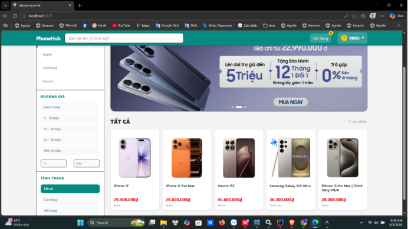
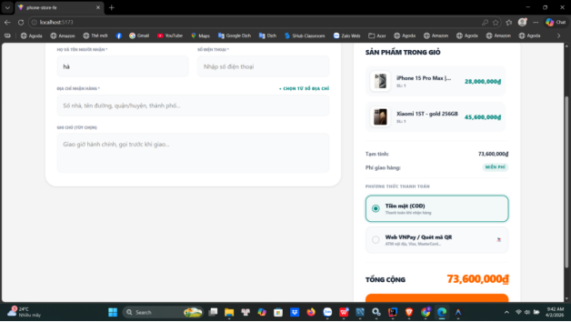
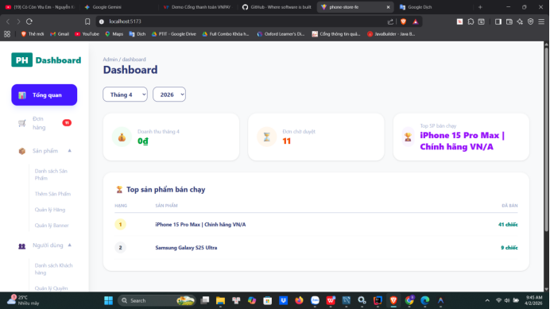

# 📱 PhoneHub - Client & Admin Interface

👉 [Click here to view the Backend RESTful API Repository](https://github.com/tuifffff/phonestore_be)

## 📌 Project Overview
PhoneHub is the comprehensive Client and Admin frontend for a modern e-commerce system. Built with performance and usability in mind, it delivers a dynamic Single Page Application (SPA) experience. From the administrative data-driven dashboards to the seamless and intuitive checkout workflow for customers, this application is built to prioritize user-centric design, robust data representation, and efficient REST API integrations.

## 🛠 Tech Stack


* **React 19:** Delivering an incredibly fast, interactive, and modern user interface.
* **Vite:** Next-generation frontend tooling for ultra-fast, optimized development builds.
* **Tailwind CSS 4:** Modern, utility-first CSS framework for responsive and beautiful UI design.
* **Redux Toolkit:** Powering complex state management for the Cart, User Authentication, and permissions.
* **Recharts:** Composable charting library supplying the interactive Data Visualization elements.

## 📸 Gallery / Screenshots


<br>
*Customer Storefront - Exploring the latest devices*

<br>
*Seamless Checkout - Dynamic geographical API integrations*

<br>
*Admin Dashboard - Data-driven business insights*

## ✨ Key Features

* 📊 **Data-Driven Admin Dashboard:** Leverage comprehensive visualizations (built with Recharts) to monitor sales velocity, member statistics, and inventory metrics in real-time.
* 🛍️ **Seamless Checkout Experience:** A smooth checkout flow with out-of-the-box integration into 3-tier geographical APIs ensuring highly accurate delivery address validation and processing.
* 🧠 **Complex State Management:** Robust, centralized handling of JSON Web Tokens (JWT), shopping cart persistence, and role-based interface access utilizing Redux Toolkit.
* 🖥️ **Responsive & Modern UI:** A premium, visually distinct interface constructed dynamically with Tailwind CSS 4, assuring optimal user experiences across all resolutions and devices.

## 🚀 Getting Started

### Prerequisites
Make sure you have installed on your local machine:
* **Node.js** (v18+ recommended)
* **npm** or **yarn**

### Installation & Run

1. **Navigate to the frontend directory:**
   ```bash
   cd phone-store-fe
   ```

2. **Install all Node dependencies:**
   ```bash
   npm install
   ```

3. **Configure the Environment Interfaces:**
   Create a `.env` file in the root directory and inject your API configurations (e.g., base URL):
   ```env
   VITE_API_BASE_URL=http://localhost:8080/api
   ```

4. **Launch the development server:**
   ```bash
   npm run dev
   ```

5. The application will be alive at usually [http://localhost:5173](http://localhost:5173). Connect your browser to start building!
